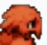

# Bird Brains Bot

This unwieldy nest of code powers BirbBrainsBot, who lives in [FFTBattleground](https://www.twitch.tv/fftbattleground).  

Contained in this repository:

* Messy data code that downloads match history and processes into a deep neural network.
* My own partial implementation of Final Fantasy Tactics battle system, written in Rust, that helps power the same.
* The twitch bot that communicates Bird's bets, and reads events that happen in the stream.
* The discord bot that notifies you when a skill you want is coming up.
* Bird's website, with the betting log.
* Bird's "brain" that determines who to bet on and how much.
* __Nearly none of the data or instructions you need to run it yourself__ . Because there can only be one.

